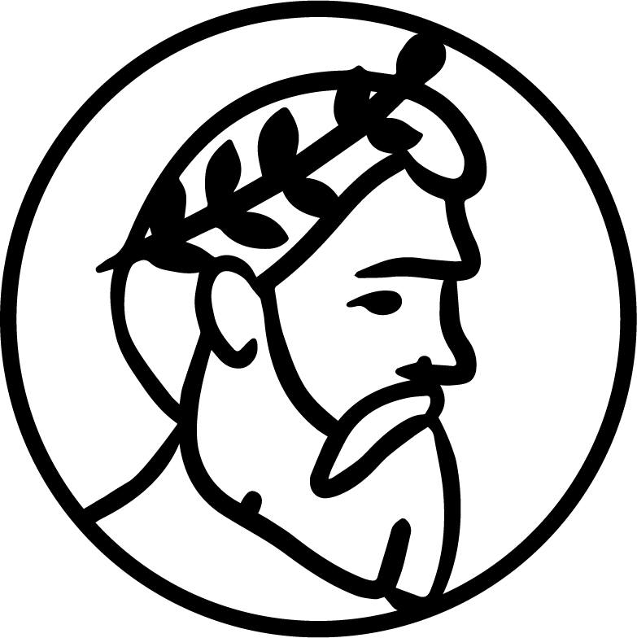

# Branding Kit

### Demos Logo

<figure><figcaption>
logo.png
</figcaption></figure>

<figure><figcaption>
logo.svg
</figcaption></figure>


logo.ai


<figure><figcaption>
inverted.png
</figcaption></figure>

<figure><figcaption>
gold.png
</figcaption></figure>

### Banner

<figure><figcaption>
banner.png
</figcaption></figure>

<figure><figcaption>
banner.svg
</figcaption></figure>


banner.ai


<figure><figcaption>
invertedbanner.png
</figcaption></figure>

<figure><figcaption>
goldbanner.png
</figcaption></figure>

### Style Sheet


Style Sheet


