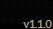

# How to burn/delete enrollment

### <mark style="color:yellow;">Steps to burn/delete your enrollment & MEID token</mark>

Prior Checks: **Ensure the wallet has testnet ETH available in wallet to burn MeID token**&#x20;

a) Go to url [https://app.demos.global/dashboard/hemi](https://app.demos.global/dashboard/hemitest)

b) Connect the wallet that was enrolled {Onboarded}&#x20;

<figure><figcaption>
The following screenshot details the wallet is 'onboarded' and has a MeID token minted.
</figcaption></figure>

c) Go to the ‘_<mark style="color:yellow;">**settings**</mark>_’ button and click on ‘_<mark style="color:yellow;">**Burn MeID**</mark>_’, where you will be prompted for a confirmation that you wish to delete your MeID Enrollment (step 1) . Click on ‘_<mark style="color:yellow;">**Yes, burn my token**</mark>_’. From here your wallet will prompt the person to sign a message authorising the transaction to burn enrollment.&#x20;

<mark style="color:orange;">**if ‘settings’ are not available, clear cookies and cache or try a different browser \[Important to note, there is a 3-day Timeout on burning the token at the contract level}**</mark>&#x20;

<figure><figcaption>
Click on 'Settings'
</figcaption></figure>

<figure><figcaption>
If a MeID has bee minted 'Burn MeID' will appear
</figcaption></figure>

d) If the wallet doesn’t have MeID tokens on other chains and deleting MeiD is successful, you will see an option to ‘_<mark style="color:yellow;">**Mint**</mark>_’ again. <mark style="color:purple;">**DO NOT MINT**</mark>**&#x20;again unless required.**&#x20;

e) To complete the next stages, click on ‘_<mark style="color:yellow;">**settings**</mark>_’ then ‘_<mark style="color:yellow;">**Purge MeID enrollment**</mark>_’; a prompt will ask for confirmation from there. To delete, choose ‘_<mark style="color:yellow;">**Deactivate account**</mark>_’&#x20;

<figure><figcaption>
Purge biometrics will only appear if MeID has been burnt
</figcaption></figure>

f) <mark style="color:red;">**IMPORTANT**</mark>**:** A timeout will appear confirming the data is being deleted; return after a timeout to enroll a new person on the wallet. **If a wallet has been tagged as a duplicate the error message will remain displayed until a successful enrollment has been completed.**\
\
**The following message will be displayed if the connected wallet has detected a duplicate enrollment in the system&#x20;**_<mark style="color:green;">**"Our records show that the biometrics associated with the connected wallet are already enrolled on a different wallet. If the biometrics have been deleted and you wish to switch wallets, a successful enrollment will clear the error message. However, if you have attempted to enroll on multiple wallets, there is a risk that the warning may not resolve."**</mark>_

<mark style="color:yellow;">IMPORTANT NOTE : once the wallet enrolment has been deleted after the 7-day timeout, the person can attempt to enroll on another wallet. If a wallet was tagged as a duplicate, if the person successfully enrolls on that wallet, the message will disappear. If the person has attempted to enroll on another wallet the message will continue to display.</mark>

